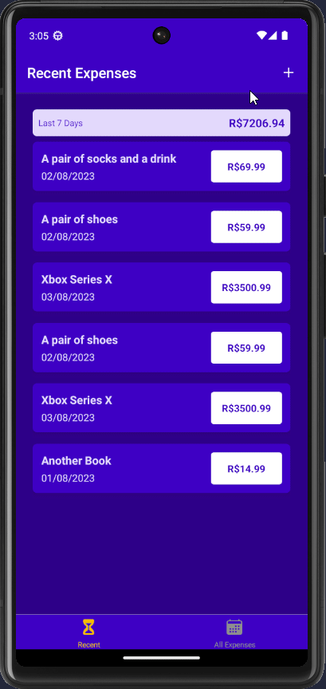
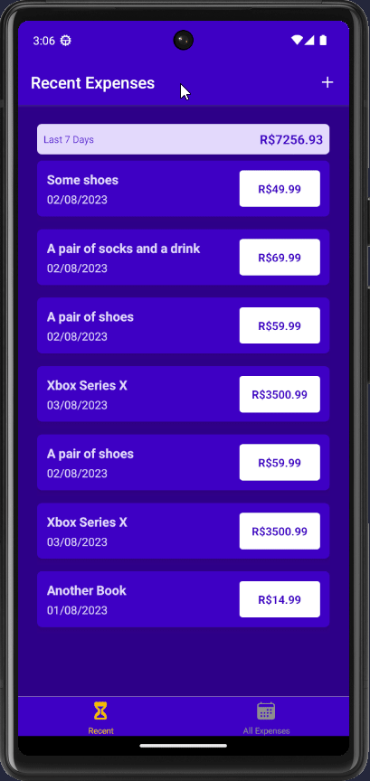

# 💸 Expenses Tracking App

Yet another Expenses Tracking App.
I made this one for practicing more React Native layout composition, styling,
state management, global state management with the Context API and Nested Navigators.
Some new concepts I applied are: form building, form validation, visual error feedback.

## ⚙ Techs used

- React
- React Native
- Expo
- React Navigation (Native Stack and Bottom Tabs)

## 📼 Some demos

### Adding an Expense

### Editing an existing Expense

